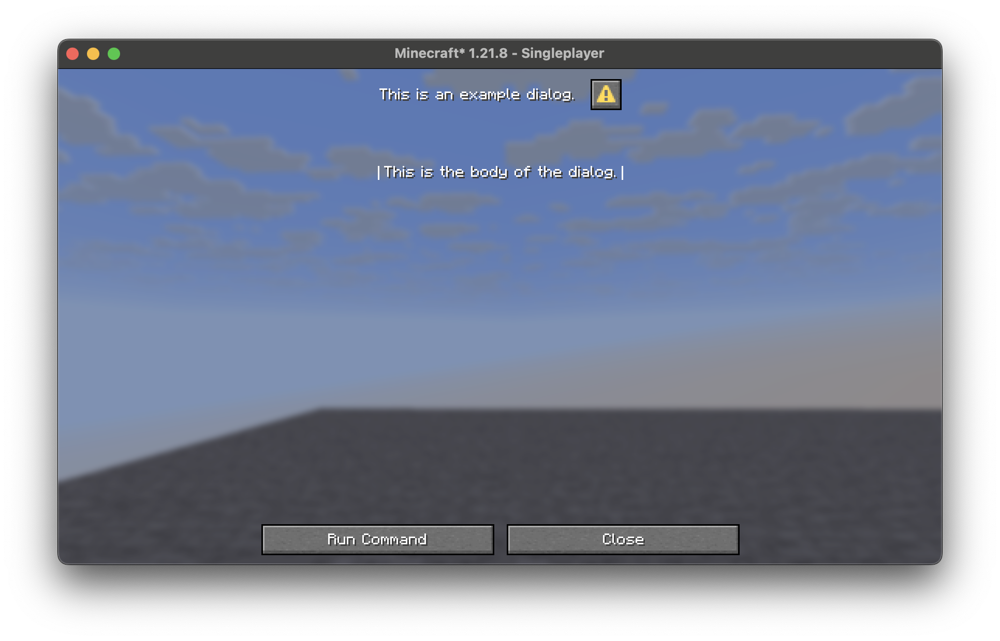
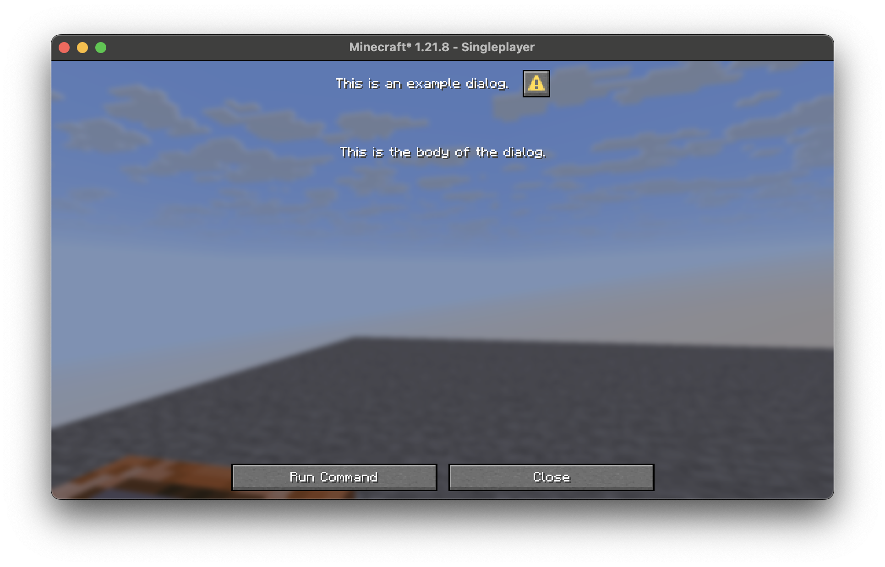
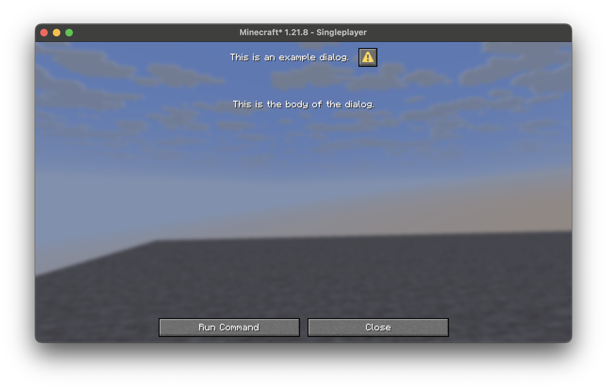
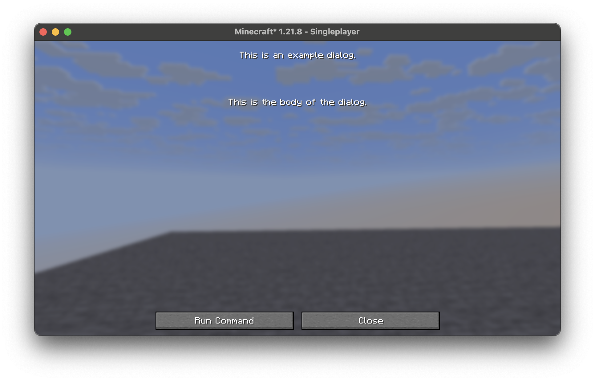
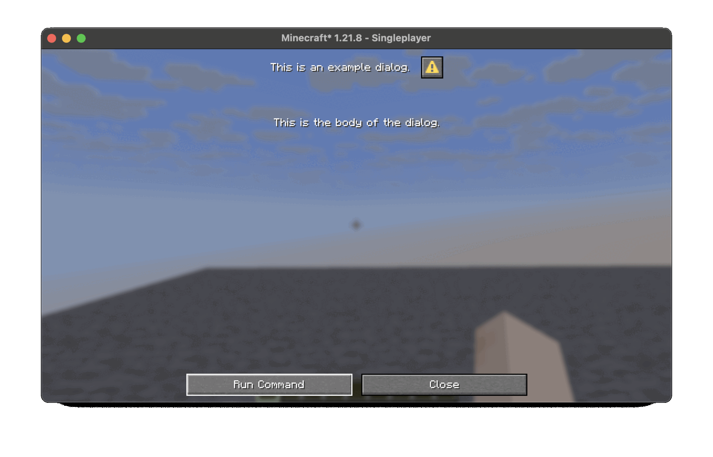

    
    <h1 style="margin: 0; padding: 0;">Unjank</h1>

> A set of QoL improvements, designed for datapacks.

> This mod depends on [owo-lib](https://modrinth.com/mod/owo-lib)

## Features
### Client-side

> Access the config via `/owo-config unjank` or [Mod Menu](https://modrinth.com/mod/modmenu)

**Disable Focus Border** (default = `True`)

Disables the white outline around text elements in dialogs.

> Disable Focus Border = `False`

> Disable Focus Border = `True`

**Disable Warning Box** (default = `True`)

Disables the warning box on custom dialogs.

> Disable Warning Box = `False`

> Disable Warning Box = `True`

**Disable Command Warning Screen** (default = `True`)

Disables the warning screen when running commands of op-level 1+.

> Disable Command Warning Screen = `False`

> Disable Command Warning Screen = `True`

### Server-side

**Gamerule** `sendTriggerFeedback` (default = `disabled`)

Controls the feedback of the `/trigger` command directly.

Possible values:

`disabled`: No command feedback shown to any player.

`sourceOnly`: Command feedback only show to the player that ran it.

`sourceAndOps`: Command feedback shown to the player that ran it *and* operators.
