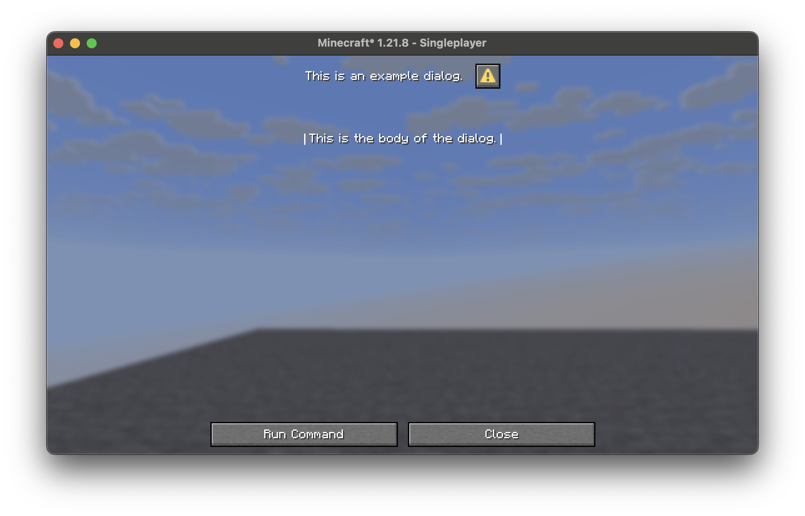
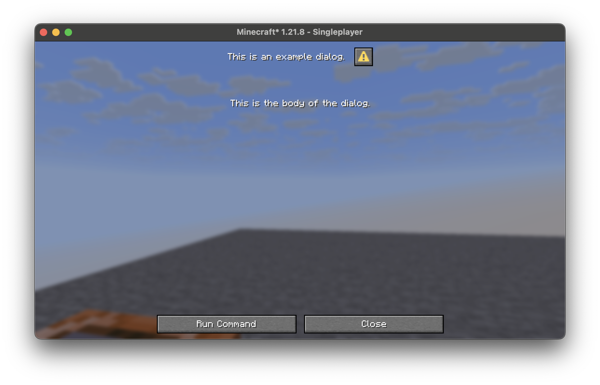
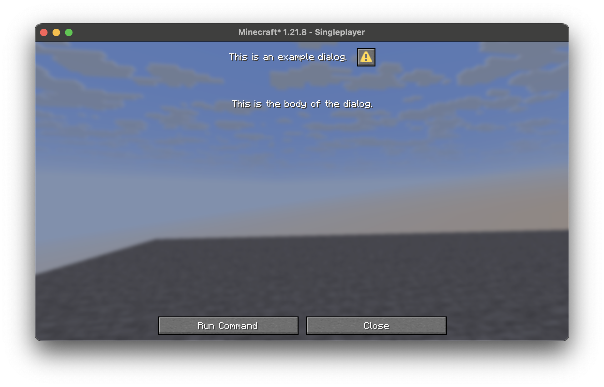
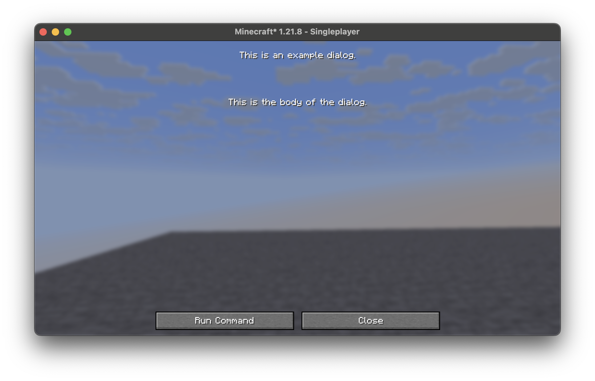
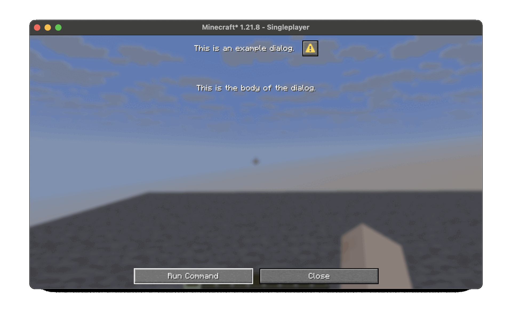

# Unjank

> A set of QoL improvements, designed for datapacks.

> This mod depends on [owo-lib](https://modrinth.com/mod/owo-lib)

## Client-side Features

### Force close a GUI screen
Pressing `Alt+Escape` while in a screen/dialog, will force it to close.

> Access the config via `/owo-config unjank` or [Mod Menu](https://modrinth.com/mod/modmenu)

### Disable Focus Border (default = `True`)

Disables the white outline around text elements in dialogs.

> Disable Focus Border = `False`

> Disable Focus Border = `True`

### Disable Warning Box (default = `True`)

Disables the warning box on custom dialogs.

> Disable Warning Box = `False`

> Disable Warning Box = `True`

### Disable Command Warning Screen (default = `True`)

Disables the warning screen when running commands of op-level 1+.

> Disable Command Warning Screen = `False`

> Disable Command Warning Screen = `True`

## Server-side Features

### Gamerule `unjank:send_trigger_feedback` (default = `sourceAndOps`)

Controls the feedback of the `/trigger` command directly.

Possible values:

`disabled`: No command feedback shown to any player.

`sourceOnly`: Command feedback only show to the player that ran it.

`sourceAndOps`: Command feedback shown to the player that ran it *and* operators.

### Gamerule `unjank:broadcast_macro_failure` (default = `false`)

If enabled, macros that fail to be instantiated will be broadcast to *all* operators on the server.

### Gamerule `unjank:log_macro_failure` (default = `false`)

If enabled, macros that fail to be instantiated will be logged in the game's output log.